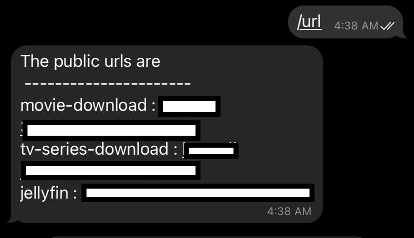

# Ngrok Telegram bot

**Read [this](https://www.abagade.com/ngrok/) blog for a more detailed guide**

This bot works along with [Ngrok](https://ngrok.com/). Ngrok is a tool that is used to expose your local service to the internet. A simple use case would be a local web application you created that you want your friends to check out. 
The tool comes with a free version which is okay for private use but the major limitation is you cannot choose a submdomain for your end point. To solve this problem I've come up with a simple solution
## Solution
Ngrok provides an API to query the information from your system. What this bot does, is it queries the Ngrok API end point to get the the public URLs and returns the formatted output as a text message. You can add this bot to any telegram group so your friends can get the URL directly. 
## How to run this bot
1. Create a telegram bot following [this](https://core.telegram.org/bots) guide
2. Copy the access token, you'll require this token to respond to this bot.
3. Set this token as an Environment variable using command `export BOT_TOKEN="<access-token>"` command or just replace the variable with actual value on line 31
4. Once you set the access token run this python script using command similar to `python3 bot-telegram.py`
5. Now once this bot is accepting connections you can just type `/url` command to get a list of all the public URLs along with the tunnel name. 

<div align="center">
    
</div>

## URL redirects using github pages
I've added additional functionality to setup redirects directly using github pages. This means you will have a fixed url which will then transparently redirect to the latest ngrok tunnel URL. 
### Setup JekyllRedirectFrom
You can go with a simple HTTP or JS redirect using github pages but using JekyllRedirectFrom limits the amount of text you have to write. You'll need to enable JekyllRedirectFrom on github pages following the instructions mentioned [here](https://github.com/jekyll/jekyll-redirect-from). Once you do that you can setup redirect simply using following snippet. 
```md
---
title: jellyfin 
redirect_to: https://tunnel.in.ngrok.io
---
```
### Push a commit with updated url at every boot
I've included the code to push the changed ngrok urls once script is invoked. You can refer change_redirect_file method in bot-telegram.py file to understand how we push the changed urls. You'll also need to setup ssh keys for your github accounts, this will make it easier to push the commits without putting username passwrod everytime. Follow [this](https://docs.github.com/en/github/authenticating-to-github/connecting-to-github-with-ssh) guide to setup SSH keys and set the upstream branch to use ssh by running `git remote set-url origin git@github.com:<Username>/<Project>.git` command.

Change the PATH_OF_GIT_REPO variable to point to your repo location on system and you are set.

### Modify the systemd service to run the above script everytime ngrok restarts
Once you do the above changes you'll also need to take care f the case when the ngrok service is restarted. To make sure our telegram_bot service restarts when ngrok service restarts include the following parameter in unit section. 
```ini
PartOf=ngrok.service
```


Once you do the above steps your friends can easily reach your service by visiting the your <github-pages-url>/tunnelname

